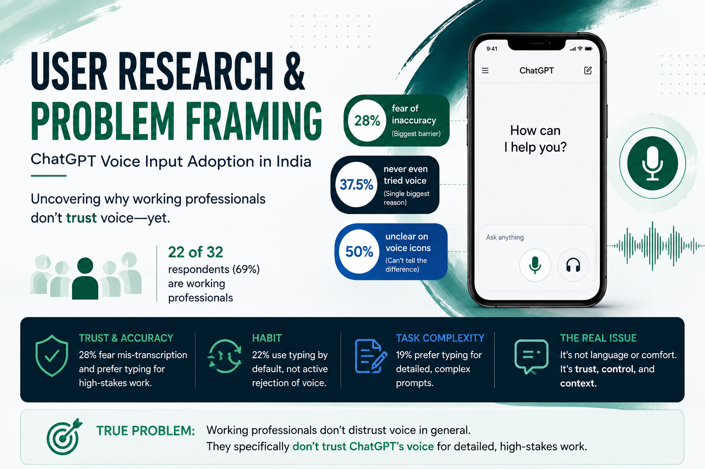

# Milestone 2 — User Research & Problem Framing

**Product Management Fellowship | Cohort 52**

## Problem Statement

**How might we increase Voice Input usage on the ChatGPT mobile app in India?**

After exploring the market and competitive landscape in Milestone 1, this milestone focuses on going deeper into the **user** — identifying the right segment, analysing survey evidence, uncovering barriers, and framing the problem worth solving.

## What I Explored

- 👥 **Segment Selection** — Which user segment has the strongest evidence and opportunity?
- 📊 **User Research** — What are users actually doing with voice across AI and everyday apps?
- 🔍 **Pain Points** — Why do users choose typing over voice?
- 🧠 **Problem Framing** — What is the underlying problem, rather than the obvious symptom?
- 🎯 **Hypotheses** — What should be validated next?

## Research Snapshot

**32 respondents** | **August 2026**

### The segment

**22 of 32 respondents (69%) were working professionals** — the largest validated segment in the survey.

Importantly, **55% of the working professionals surveyed were regional-language-first or based outside metro cities**, so the segment was not purely an English/metro sample.

### What the research revealed

| Finding | Evidence |
|---|---:|
| Working professionals in sample | **69% (22/32)** |
| Unclear about the two ChatGPT voice icons | **50%** |
| Never tried ChatGPT voice | **37.5% (12/32)** |
| Trust & accuracy as the biggest coded pain-point theme | **28% (9/32)** |
| Habit — typing is the default behaviour | **22% (7/32)** |
| Task complexity — typing gives more control | **19% (6/32)** |
| Mostly voice on ChatGPT | **0% (0/32)** |
| Mostly voice on Gemini | **18.8% (6/32)** |

## Key Insight

> **The problem isn't that users reject voice. They don't yet trust ChatGPT's voice enough for the detailed work they rely on it for.**

The research points to three major barriers:

### 1. Trust & Accuracy
Fear of mis-transcription was the largest coded theme. Users want confidence that their detailed prompts will be captured correctly.

### 2. Habit
Typing is often the default behaviour. This is not necessarily active rejection of voice — users simply return to the interaction method they already know.

### 3. Task Complexity
For detailed or high-stakes work, users feel typing provides greater control.

## Discover → Try → Succeed → Repeat

The research also revealed a two-stage adoption problem:

**37.5% had never tried voice.**

Among those who had tried it, users reported issues including:

- Mixing languages mid-sentence
- Feeling awkward speaking aloud
- Accent/language recognition problems
- Returning to typing for greater control

This suggests that simply increasing first-time voice trials will not be enough.

**The product needs to help users move from:**

`Discover → Try → Succeed → Repeat`

## The Problem I Would Solve

### Not:

> “How do we get more Indians to use voice?”

### Not simply:

> “How do we add more regional languages?”

### Instead:

> **Working professionals won't trust ChatGPT's voice with their real work until it demonstrably preserves accuracy and control for complex tasks.**

This is the problem I would take forward for validation.

## What I Would Validate Next

### Hypothesis 1 — Clearer voice entry points
Can clearer labels such as **Dictate** and **Talk** reduce confusion and increase first-time usage?

### Hypothesis 2 — Better error recovery
Can in-place correction of transcription mistakes improve successful task completion and trust?

### Hypothesis 3 — Language consistency
Does more reliable language detection and continuity increase repeat voice usage?

### Hypothesis 4 — Voice for complex work
Can voice support detailed tasks without making users feel they are giving up the control they have with typing?

These are **hypotheses, not final feature decisions**.

## Methodology & Caveats

- **Sample:** 32 respondents
- **Collection:** August 2026
- **Audience:** Primarily personal/professional network
- **Primary validated segment:** Working professionals
- Qualitative themes were coded from open-text responses.
- Regional-language/Tier 2–4 and exam-prep outreach was attempted separately, but those channels did not produce direct responses.
- Findings are **directional** and should not be treated as representative of India's entire ChatGPT user base.

## Deliverables

📄 **[View Milestone 2 Presentation](Milestone-2-User-Research-Problem-Framing.pdf)**

📝 **[Read the Full Case Study](Milestone_2_Blog.md)**

---

## Key Takeaway

**Don't optimise for more voice taps.**

Optimise for:

> **Discover → Try → Succeed → Repeat**

Because adoption isn't created simply by making a feature available.

**It is created when users trust the feature enough to make it part of their behaviour.**

---

### Source

**Primary research:** ChatGPT Voice Survey, n=32, August 2026, conducted by Sushant Mulmuley.
